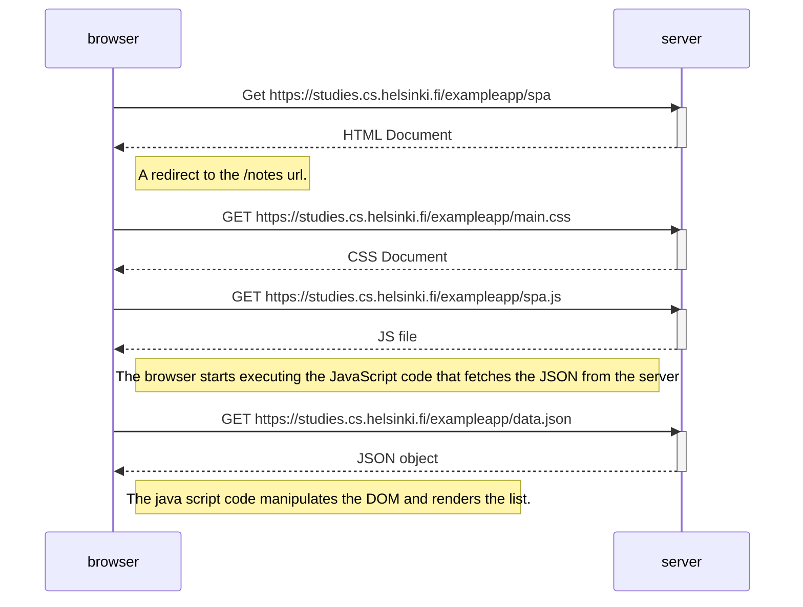

```mermaid
sequenceDiagram
participant browser
participant server

    browser->>server: Get https://studies.cs.helsinki.fi/exampleapp/spa
    activate server
    server-->>browser:  HTML Document
    deactivate server
    Note right of browser: A redirect to the /notes url.

    browser->>server: GET https://studies.cs.helsinki.fi/exampleapp/main.css
    activate server
    server-->>browser: CSS Document
    deactivate server

    browser->>server: GET https://studies.cs.helsinki.fi/exampleapp/spa.js
    activate server
    server-->>browser: JS file
    deactivate server
    Note right of browser: The browser starts executing the JavaScript code that fetches the JSON from the server

    browser->>server: GET https://studies.cs.helsinki.fi/exampleapp/data.json
    activate server
    server-->>browser: JSON object
    deactivate server

    Note right of browser: The java script code manipulates the DOM and renders the list.
```
